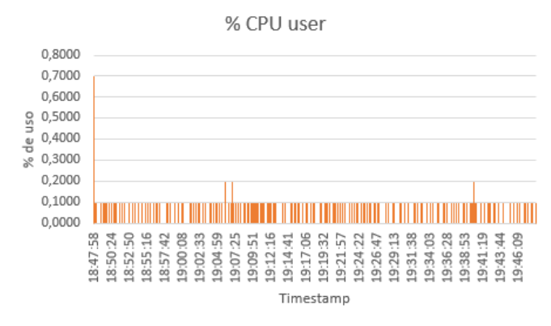
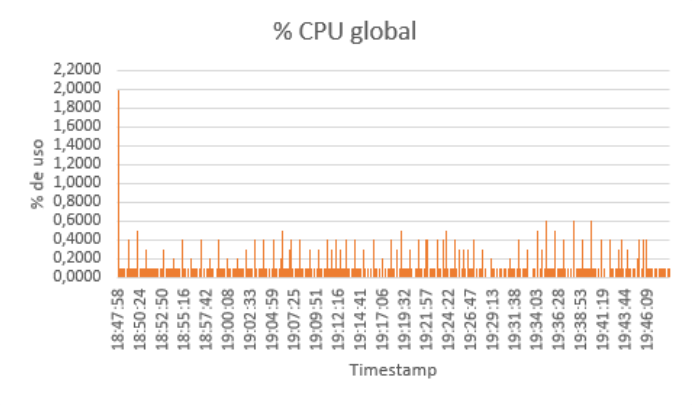
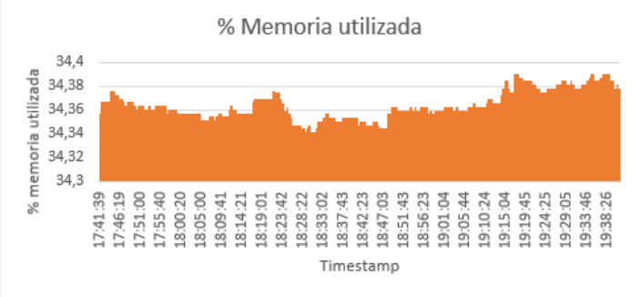
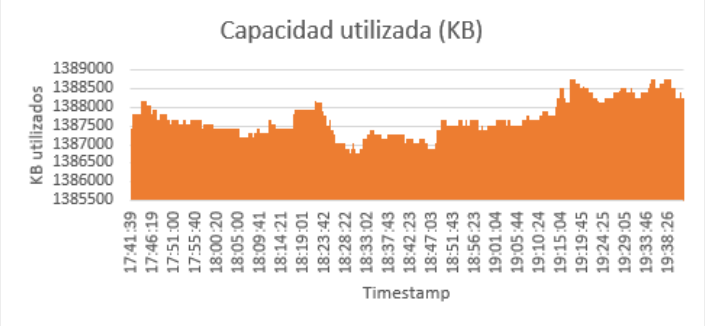

```{r setup, include=FALSE}
knitr::opts_chunk$set(echo = TRUE)
```

\newpage

Las medidas y pruebas realizadas en esta práctica han sido realizadas en una
máquina virtual Oracle VM con sistema operativo Ubuntu 16.04 a la cual le fueron
otorgados 8 procesadores y 4GB de memoria RAM.

# 1. Monitorización de la CPU

## 1.1. Recolección de los datos

En esta primera prueba de monitorización, se nos pedía realizar un muestreo de
la CPU de nuestro sistema durante 1 hora, con un intervalo de muestreo de 2
segundos. Para esta monitorización, decidimos utilizar el monitor `top`. Para 
realizar las muestras durante exactamente una hora, calculamos cuantas muestras
cada 2 segundos se podían hacer en 1 hora:

$$\frac{(1h\cdot60min\cdot60seg)}{2seg}=1800\ muestras$$
Una vez sabiendo este dato, utilizamos el siguiente comando para recoger la 
información que nos interesaba y redirigirla a un fichero:

```bash
top -b -d2 -n1800 | grep -e '^top' -e '^%Cpu' | paste -sd "#" > raw-cpu-data.txt
```

De esta manera obtenemos el timestamp que se muestra en la primera linea del `top`
y la línea donde se encuentra toda la información sobre la CPU. Después todo
esto quedaría unido en una sola línea gracias al comando `paste`. Tomamos la
decisión de tomar este formato porque nos facilitaba el limpiado de datos que 
realizamos con un programa en Java que elimina la información irrelevante para
este apartado y deja los datos en formato csv.

## 1.2. Pregunta 1: ¿Cuántas CPUs tiene el sistema que se ha monitorizado? ¿De dónde se ha obtenido esa información?

El sistema que hemos monitoreado tiene 8 CPUs. Hemos optenido esta información
del monitor `top`, con el cual si pulsamos la tecla "1" mientras está activo, nos 
da una información más detallada de las CPUs donde estas se listan desde la
CPU0 hasta la CPU7.

\begin{figure}
  \centering

\includegraphics[width=0.8\textwidth]{assets/top-8cpus.png}
  \caption{Visualizacion de las 8 CPUs en el monitor top}
\end{figure}

## 1.3. Pregunta 2: ¿Cuál es la utilización media de la CPU en modo usuario, sistema y en global?

Para calcular las medias de utilización de la CPU, hemos eliminado los dos
primeras filas de datos, ya que estas tenían un valor más alto de lo normal
debido a que el monitor `top` se estaba lanzando en esos momentos. Al quitar
estos datos evitamos que produzcan una distorsión en los cálculos de las medias.

La media de uso de la CPU en modo usuario es de 0.010901%, la media en modo
sistema es de 0.01902113% y en global es de 0.03565072%. Los cálculos para sacar el
uso de la CPU en modo usuario y sistema han sido muy sencillos de obtener ya que
son datos que obtenemos directamente del monitor `top`, y por tanto nos basta con
hacer la media de todos los datos obtenidos. En cambio, no tenemos directamente
el dato del porcentaje de uso global en el monitor, por lo que tuvimos que 
calcularlo con ayuda del porcentaje que estuvo el procesador en **modo idle**.
Este modo nos indica que porcentaje de tiempo el procesador no ha estado 
realizando ninguna tarea y por tanto, si le restamos el porcentaje de tiempo que
ha estado sin realizartareas al tiempo total, obtenemos el porcentaje global de uso.

## 1.4. Pregunta 3: ¿Cómo se comportan las medidas anteriores a lo largo del tiempo de observación? Muestra las tres métricas de forma gráfica.

Lo primero que se ve a simple vista de las 3 gráficas es que se produce un pico
más alto justo al princio de las muestras. Esto se debe seguramente a el
lanzamiento del monitor `top`, ya que después no se vuelve a repetir una muestra
así.

Para empezar, en el gráfico del porcentaje de uso en modo usuario (ver figura 2),
se puede observar que se mantiene la mayoría del tiempo en 0% con bastantes subidas
a 0.1%, exceptuando algunos momentos puntuales. Podemos suponer que este porcentaje 
tan bajo y estable se debe a que durante la toma de las muestras el usuario no 
tuvo interacción con el sistema.

En el gráfico de porcentaje de uso en modo sistema (ver figura 3), podemos ver
que las muestras son mucho más irregulares, con muchos altibajos durante todo
el proceso de muestreo.

Por último, en el gráfico del porcentaje de uso de la CPU global (ver figura 4),
podemos ver como de manera regular se procuden picos de uso que cuadran con los 
picos de uso que se podían apreciar en el gráfico de uso del sistema. Por tanto,
podemos concluir que esos picos se deben al mismo uso del sistema.

{width=275}

{width=275}

{width=275}

## 1.5. Pregunta 4: ¿Cuál es la sobrecarga provocada por el monitor TOP?

Para calcular la sobrecarga del monitor `top`, necesitamos el tiempo que tarda 
en ejecutarse. Para ello,hemos usado el siguiente comando:

```bash
time top -b -d1 -n1
```

Este comando nos da el tiempo que tarda el monitor en ejecutarse. Nos interesa 
el dato de tiempo **real**. En nuestro caso, el tiempo que tardó fue 0.188 
segundos. Ahora usamos la fórmula de la sobrecarga usando como intervalo de 
medida 2 segundos, que es el intervalo que hemos usado para tomar las muestras:

$$OV_{top} = \frac{0.188}{2} = 9.4\%$$

# 2. Monitorización de la memoria principal

## 2.1. Recolección de datos

En esta prueba, se nos pidió monitorear la memoria principal de nuestro sistema
durante un preiodo de 2 horas, con un intervalo de muestreo de 5 segundos. En
este caso decidimos usar el monitor `vmstat` y para saber cuantas muestras
teniamos que realizar, lo calculamos de igual manera que en el cálculo del primer
apartado:

$$\frac{(2h\cdot60min\cdot60seg)}{5seg}=1440\ muestras$$

Una vez sabiendo la cantidad de muestras que teníamos que tomar, utilizamos el
siguiente comando para recolectar los datos:

```bash
vmstat 5 1440 -n -t | paste -sd "#" > raw-memory-data.txt
```

Los primeros dos parámetros le indican al `vmstat` el delay entre muestras y la
cantidad de muestas que tiene que tomar respectivamente. El flag `-n` le indica
al monitor que solo debe mostar una vez la cabecera inicial y el flag `-t` hace
que el monitor añada una última columna en la que se muestra el `timestamp`.
Este flag nos ayuda mucho porque nos permite tener todos los datos necesarios
utilizando solo un monitor. Para acabar con la explicación del comando usado, el
uso de `paste` nos ayuda a juntar todo el output obtenido en una sola linea,
separando cada muestra por un "#". Esto nos permite limpiar facilmente los datos
con nuestro programa escrito en Java y dejarlos en un formato csv.

## 2.2. Pregunta 1: ¿Qué capacidad total tiene la memoria principal del sistema? ¿De dónde se ha obtenido ese dato?

La capacidad de la memoria principal es de 4038176KB. Esta información la hemos 
obtenido con el comando `free`. Este comando nos proporciona un número exacto 
pero sin unidades. Buscando información, hemos encontrado que normalmente los 
números mostrados por la instrucción `free` se representan en KB pero, para 
asegurarnos, hemos ejecutado el comando free -h que sí que da las unidades aunque,
en cambio, redondea el número. A partir del número redondeado con las unidades, 
hemos hecho la conversión y nos hemos asegurado que el número que nos daba free 
estaba en las unidades de KB.

## 2.3. Pregunta 2: ¿Cuál es la utilización media de la memoria? ¿Y la capacidad media utilizada?

El porcentaje de uso medio de la memoria fue de 34.36% y la capacidad media
utlizada fue de 1387694,11KB. Estos datos han sido calculados haciendo la media
de las columnas %Memoria Utilizada y Capacidad utilizada, respectivamente.

## 2.4. Pregunta 3: ¿Cómo se comporta la utilización de la memoria y la capacidad utilizada? Representa estas métricas gráficamente.

Podemos observar que ambos gráficos tienen una correlación directa, ya que uno 
nos indica los valores en % (ver Figura 5) y el otro nos muestra la 
información de con los valores en KB (ver Figura 6). Con el gráfico de la 
Figura 5 podemos observar que el % de uso de la memoria durante la monitorización
se encuentra entre el 34.34% y el 34.39%, unos valores que no son muy dispares. 
Con ello podemos concluir que la memoria se ha mantenido en unos valores 
"uniformes" durante todo el muestreo, sin ningún pico significativo y con una 
media del 34.364%.

{width=275}

{width=275}

## 2.5. Pregunta 4: ¿Cuál es la sobrecarga provocada por el monitor VMSTAT?

Para calcular la sobrecarga del monitor `vmstat` necesitamos el tiempo que tarda
en ejecutarse. Para ello, hemos usado el siguiente comando:

```bash
time vmstat
```

Este comando nos da el tiempo que tarda el monitor en ejecutarse. Nos interesa 
el dato de tiempo **real**. En nuestro caso, el tiempo que tardó fue 0.007 
segundos. Ahora usamos la fórmula de la sobrecarga usando como intervalo de 
medida 5 segundos, que es el intervalo que hemos usado para tomar las muestras:

$$OV_{vmstat} = \frac{0.007}{5} = 0.14\%$$

# 3. Monitorización en paralelo

## 3.1. Script y recolección de datos
En el último apartado de la práctica, se nos pidió monitorizar la CPU y la memoria
durante 2 horas esta vez en paralelo. Para ello, hemos creado un script en bash 
llamado monitoring.sh que nos permite tomar estas muestras de manera simultánea 
con ayuda del monitor `top`. El script es el siguiente:

```bash
# $1 represents the number of samples to take
# $2 represents the delay between samples
for ((i=1; i <= $1; i++)); do
  tp=$(top -b -d1 -n1 | grep -e "top -" -e "%Cpu(s)" -e "KiB Mem" | paste -sd "#")
  printf "%s#" "$tp"
  sleep $2
done
```

Este script toma dos parámetros, el primero es el número de muestras que queremos
tomar y el segundo es el delay entre muestras. El script ejecuta un bucle que 
toma las filas que nos interesan del monitor top, las cuales son en la que se 
muestra el **timestamp**, la del **porcentaje de uso de la CPU** y la de la 
**memoria principal**. Una vez obtenidas estas filas, las juntamos en una sola, 
separandolas por un `#` y la enseñamos por pantalla. Por último, este realiza un
`sleep` de tantos segundos como indique el segundo parámetro.

Una vez tenemos el script, nos falta saber un último dato antes de ejecutarlo,
ya que el enunciado solicitaba que teniamos que tomar las muestras con un
intervalo de medida tal que la sobrecarga generada por el monitor no superase el
10%. 

Para sacar este dato, necesitamos el tiempo que tarda el monitor `top` en ejecutarse,
cosa que hemos calculado en el apartado 1.5. El tiempo que tarda en ejecutarse es
de 0.188 segundos. Ahora, para obtener el intervalo de medida despejaremos la
formula de la sobrecarga de la siguiente manera:

$$OV = \frac{T_{ejecucion}}{Intervalo\ medida},\ Intervalo\ medida = \frac{T_{ejecucion}}{OV}$$

Sustituyendo con los valores que tenemos, obtenemos el siguiente resultado para
el intervalo de medida:

$$Intervalo\ medida = \frac{0.188}{0.1} = 1.88\ segundos$$

Por último, calculamos el número de muestras que necesitamos tomar:

$$\left\lfloor\frac{(2h\cdot60min\cdot60seg)}{1.88seg} \right\rfloor=3829\ muestras$$

Utilizamos la función suelo para redondear hacia abajo, ya que si redondearamos
hacia arriba, estaríamos tomando más muestras de las necesarias.

Ahora ya podemos ejecutar nuestro script redireccionando la salida hacia un fichero
para poder procesarlo posteriormente:

```bash
./monitoring.sh 3829 1.88 > raw-paralel-data.txt

```

# 4. Pregunta voluntaria: Expresar la fórmula de la sobrecarga de la monitorización cuando dos (o más) monitores se están ejecutando en paralelo.

La formula general para calcular la sobrecarga de monitorización cuando dos o más
monitores se están ejecutando en paralelo es la siguiente:

$$OV_{TOTAL} = \sum_{i=1}^{n} \frac{Tiempo\ de\ ejecución\ del\ monitor_i}{Intervalo\ de\ medida_i} $$

Donde $OV_{TOTAL}$ es la sobrecarga total, $n$ es el número de monitores que se
ejecutan en paralelo, el $Tiempo\ de\ ejecución\ del\ monitor_i$ es el tiempo que
tarda el monitor $i$ en ejecutarse y, el $Intervalo\ de\ medida_i$ que se le ha 
indicado al monitor $i$.

Esta formula la podemos obtener de la formula de la sobrecarga de monitorización,
pero, al tener $n$ monitores que se ejecutan en paralelo en diferentes terminales,
necesitamos hacer el sumatorio de cada uno de los overheads que genera cada monitor.
